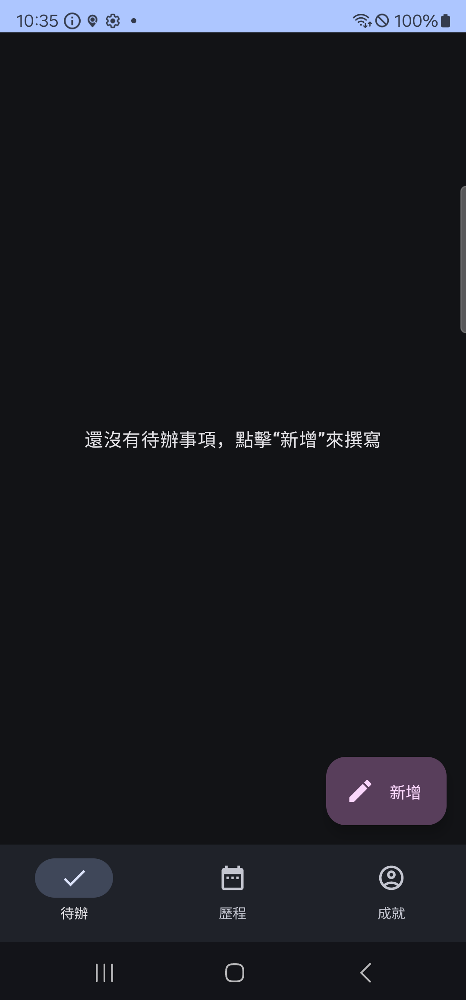
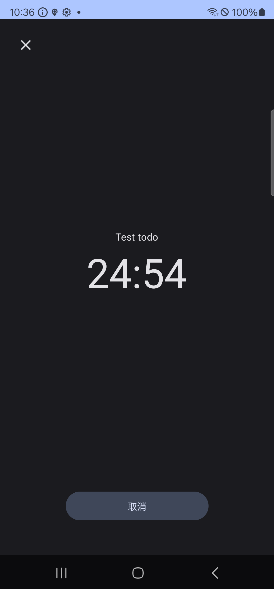
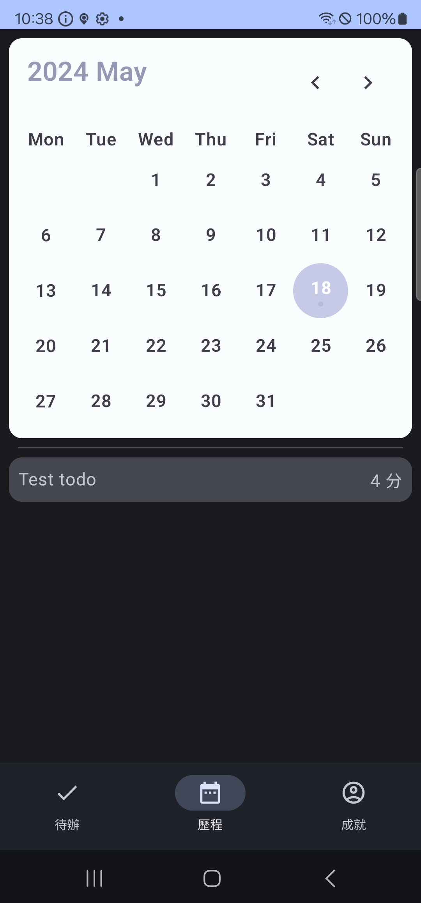

# 番茄 - 當 Todo list 遇上番茄鐘

這是一款 Android 應用程式，將番茄鐘和Todo list
結合，並配有簡單的統計功能。一起更專注、更高效的完成事情吧！這個應用程式還在開發階段，如果有任何意見歡迎寫信給開發者～

## Prerequisites

- Android Studio
- 一個新的 firebase 專案，並將 google-services.json 放在 app 目錄下，否則會編譯失敗

## 安裝

- 自行編譯
- 點[這裡](https://appdistribution.firebase.dev/i/76e036597d7c17d1)加入測試人員群組，自動下載最新版本

## 功能

- 待辦事項清單
- 番茄鐘
- 各種統計資訊
- 跨裝置同步

## 螢幕截圖

## 開放原始碼授權

- [Kalendar](https://github.com/hi-manshu/Kalendar) - Apache-2.0 license